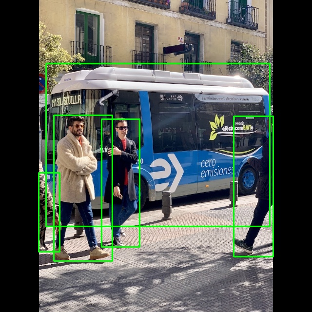

# 01. RV1106 추론 결과 및 로컬 Mac 시각화 자동화

Luckfox Pico Ultra BW(Rockchip RV1106 NPU) 보드에서 생성한 YOLOv5/RKNN 객체 탐지 결과를 로컬 Mac으로 가져와 OpenCV로 시각화하는 host-side pipeline입니다.

Luckfox 보드 공부를 처음 시작할 때, 보드에서 추론한 값들이 터미널 출력 후 기록이 남지 않으며 시각화 처리가 되지 않은 문제가 있어 이를 해결하기 위해 다음을 고안해냈습니다.

이 프로젝트의 핵심은 Edge device에서 발생한 추론 결과를 콘솔 출력으로만 확인하지 않고, 재사용 가능한 데이터 파일(`detections.txt`)로 분리한 뒤, 로컬 개발 환경에서 다시 파싱하고 시각화하는 구조를 만든 것입니다.

## Project Status

| Component | Status | Evidence |
| :--- | :--- | :--- |
| Detection result file | Completed | `detections.txt` |
| Host-side visualization | Completed | `auto_draw.py` |
| Edge-to-host transfer script | Completed | `run.sh` |
| Rendered output image | Completed | `result.jpg` |
| Target-side C++ inference source | Completed | `board_src/main.cc` |

## Repository Structure

    01_image_inference_mac/
    ├── README.md
    ├── auto_draw.py
    ├── run.sh
    ├── detections.txt
    ├── coco_80_labels_list.txt
    ├── bus.jpg
    ├── result.jpg
    └── board_src/
        └── main.cc

## Pipeline Overview

Host(Mac)와 Edge(RV1106 보드) 환경이 명확히 분리된 파이프라인으로 동작합니다.

    [Edge: RV1106 Board]
    rknn_yolov5_demo (크로스 컴파일된 실행 파일)
      ├── yolov5s-640-640.rknn (NPU 모델)
      └── bus.jpg (입력 이미지)
            └── NPU Inference 실행
                  └── detections.txt 생성
                        │
                        ▼ (SCP Transfer)
    [Host: Mac Local]
    run.sh 실행 (가져오기 및 시각화 자동화)
      └── detections.txt 파싱
            └── auto_draw.py 실행
                  └── result.jpg 생성

## Input and Output

| File | Role |
| :--- | :--- |
| `board_src/main.cc` | 바이너리를 생성하기 위한 C++ 소스 코드 설계도 (도커에서 컴파일됨) |
| `rknn_yolov5_demo` | `main.cc`를 크로스 컴파일하여 만든 **보드 구동용 바이너리 실행 파일** |
| `yolov5s-640-640.rknn` |  파이프라인 구축에 집중하기 위해 벤더사(Rockchip/Luckfox)에서 제공한 사전 양자화(Pre-compiled) **RV1106 NPU 전용 모델 파일** 활용  |
| `bus.jpg` | 객체 탐지 결과를 시각화할 원본 이미지 |
| `detections.txt` | 보드에서 실행 파일이 만들어낸 객체 탐지 결과 좌표 데이터 |
| `auto_draw.py` | 탐지 결과를 읽어 bounding box를 그리는 Python script (Mac에서 실행) |
| `run.sh` | 보드에서 `detections.txt`를 가져오고 시각화 script를 실행하는 자동화 script (Mac에서 실행) |
| `result.jpg` | bounding box와 label이 렌더링된 최종 이미지 |
| `coco_80_labels_list.txt` | COCO class label reference |

## Detection Result Format

`detections.txt`는 한 줄에 하나의 detected object를 저장합니다.

    [label] [x1] [y1] [x2] [y2] [confidence]

예시는 다음과 같습니다.

    person 208 244 286 506 0.884140
    person 479 238 560 526 0.863770
    person 110 236 230 535 0.832502
    bus 94 130 553 464 0.697392
    person 79 354 122 516 0.349309

각 필드의 의미는 다음과 같습니다.

| Field | Description |
| :--- | :--- |
| `label` | 감지된 객체 class 이름 |
| `x1`, `y1` | bounding box의 left-top 좌표 |
| `x2`, `y2` | bounding box의 right-bottom 좌표 |
| `confidence` | 모델의 confidence score |

## Key Implementation Details

### 0. OS & Network Environment (Community Ubuntu 22.04)

이 프로젝트에서는 Luckfox 커뮤니티에서 제공하는 **Ubuntu 22.04 이미지**를 사용했습니다. 
Buildroot 대비 비교적 무겁지만, `nmcli`와 같은 고수준 네트워크 관리 도구 패키지를 기본적으로 사용할 수 있어 Wi-Fi 연결 및 네트워크 인프라 구성이 훨씬 용이했습니다. 
(이후 '02_rkmpi_wireless_streaming/' 에서는 CSI 카메라 모듈 드라이버 제약으로 인해 Buildroot 기반으로 이관하며 네트워크 인프라를 직접 스크립팅하게 됩니다.)

### 1. Custom Data Serialization Layer (C++ Inference)

기존 RV1106/RKNN 기반 YOLOv5 demo는 추론 결과를 주로 콘솔(`stdout`)에 출력하는 방식으로 확인합니다. 이 방식은 사람이 터미널에서 결과를 읽기에는 충분하지만, 외부 프로그램이 결과를 다시 사용하거나 시각화하기에는 적합하지 않습니다.

이 프로젝트에서는 board_src/main.cc 소스 코드를 수정하고 크로스 컴파일하여 rknn_yolov5_demo 바이너리 실행 파일을 생성합니다. 이후 해당 바이너리가 보드에서 추론을 수행하며 객체 탐지 결과를 detections.txt라는 line-based text file로 저장하고, 최종적으로 host-side Python script가 이 파일을 다시 읽어 시각화하도록 전체 흐름을 구성했습니다.

    [label] [x1] [y1] [x2] [y2] [confidence]

이 구조를 사용하면 추론 결과가 콘솔에 일회성으로 출력되고 사라지는 것이 아니라, 다른 프로그램이 재사용할 수 있는 중간 산출물로 남습니다.

| Type | Output Method | Consequence |
| :--- | :--- | :--- |
| Before | Console output | 사람이 읽을 수는 있지만 외부 프로그램과 연동하기 어려움 |
| After | `detections.txt` file output | Python, OpenCV 등 host-side tool에서 재사용 가능 |

### 2. Edge-to-Host Transfer Pipeline

`run.sh`는 보드에서 생성된 `detections.txt`를 로컬 Mac으로 가져오고, 전송이 끝나면 곧바로 Python 시각화 script를 실행합니다.

    scp pico@<BOARD_IP>:/home/pico/yolo_test/detections.txt ./
    python3 auto_draw.py

이 흐름을 통해 보드에서 추론을 수행한 뒤, 로컬 개발 환경에서 결과를 빠르게 확인할 수 있습니다.

실제 `run.sh`의 역할은 다음과 같습니다.

1. 보드의 추론 결과 파일 위치에 접근
2. SCP로 `detections.txt`를 로컬 폴더에 복사
3. 복사 완료 후 `auto_draw.py` 실행
4. `result.jpg` 생성

### 3. Host-Side Parsing Pipeline

`auto_draw.py`는 `detections.txt`를 한 줄씩 읽고, 각 줄을 공백 기준으로 분리하여 객체 class, bounding box 좌표, confidence score를 복원합니다.

    label, x1, y1, x2, y2, score = data[0], int(data[1]), int(data[2]), int(data[3]), int(data[4]), float(data[5])

이 과정에서 텍스트 파일에 저장된 추론 결과가 Python 내부의 구조화된 값으로 변환됩니다.

### 4. OpenCV Bounding Box Rendering

파싱된 좌표를 기반으로 OpenCV를 사용해 원본 이미지 위에 bounding box와 label을 렌더링합니다.

    cv2.rectangle(img, (x1, y1), (x2, y2), (0, 255, 0), 2)
    cv2.putText(img, f"{label} {score:.2f}", (x1, y1 - 10), cv2.FONT_HERSHEY_SIMPLEX, 0.5, (0, 255, 0), 2)

렌더링이 끝나면 결과 이미지를 `result.jpg`로 저장합니다.

    cv2.imwrite('result.jpg', img)

### 5. Headless Development Workflow

Luckfox 보드는 모니터 없이 headless 환경에서 운용되는 경우가 많습니다. 이 프로젝트는 보드에 직접 디스플레이를 연결하지 않아도, 추론 결과를 파일로 가져와 로컬 환경에서 확인할 수 있도록 구성했습니다.

따라서 이 작업은 단순한 이미지 시각화가 아니라, Edge device와 host PC 사이의 debugging workflow를 만든 작업으로 볼 수 있습니다.

### 6. Cross-Compilation & Docker Infrastructure

본 프로젝트는 개발 호스트 PC 환경(**Apple Silicon M3 Pro, ARM64**)과 타겟 임베디드 보드(Rockchip RV1106, ARM32) 간의 아키텍처 차이를 극복하고, 개발 환경을 깔끔하게 격리하기 위해 **Docker 기반의 크로스 컴파일 파이프라인**을 구축하여 진행했습니다.

#### 6.1. Development Environment
- **Host Machine:** macOS (Apple M3 Pro, ARM64 아키텍처)
- **Container Environment:** `luckfox-builder` (Docker `linux/amd64` 기반 Ubuntu 에뮬레이션)
- **Target OS on Board:** Ubuntu 22.04 (Community Image)
- **Toolchain C Library:** **glibc** (`arm-rockchip830-linux-gnueabihf-gcc`)

#### 6.2. Cross-Compile Implementation Details

타겟 보드의 OS가 Ubuntu 환경이므로, 임베디드 리눅스의 표준 C 라이브러리인 **`glibc` 기반의 툴체인**을 지정하여 빌드를 수행했습니다. 

1. **호스트 아키텍처 우회:** M3 Mac 터미널에서는 ARM64로 인식되지만, Docker 컨테이너 내부를 `linux/amd64` 플랫폼으로 격리하여 x86_64 리눅스 환경 표준인 툴체인 및 Rockchip SDK 빌드 스크립트와의 호환성을 확보했습니다.

        $ uname -m
        x86_64

2. **C++ 소스 코드 커스텀 및 영속화:** 정지 이미지 추론의 결과물(Class, Bounding Box 좌표, Confidence)이 휘발되지 않도록, `board_src/main.cc` 내부의 Post-Process 결과 루프를 수정하여 파일 시스템에 로그를 기록하는 `fprintf` 기반의 파일 출력 로직(`detections.txt`)을 커스텀 구현했습니다.

3. **컴파일 및 바이너리 빌드:** CMake 및 Make 빌드 시퀀스를 통해 `/work/rknpu2/examples/RV1106_RV1103/rknn_yolov5_demo/build/build_linux_arm` 경로에서 보드 구동용 최종 실행 파일을 생성했습니다.

        cd /work/rknpu2/examples/RV1106_RV1103/rknn_yolov5_demo/build/build_linux_arm
        cmake ../..
        make install

#### 6.3. Binary Verification (Smoking Gun)

크로스 컴파일 완료 후 생성된 바이너리 검증:

- **`ARM, 32-bit`:** 호스트 PC(64비트) 환경이 아닌 RV1106 프로세서(32비트 ARM) 아키텍처용 바이너리로 크로스 컴파일됨을 증명.
- **`interpreter /lib/ld-linux-armhf.so.3`:** 02번 스트리밍 프로젝트(Buildroot/uClibc)와 달리, 본 프로젝트는 Ubuntu OS 환경에 맞춰 **`glibc` 표준 링크 인터프리터**를 참조하도록 맞춤형 빌드가 완료되었음을 기술적으로 증명.

## How to Run

### 0. 호스트에서 바이너리 크로스 컴파일 (Optional)
Docker 환경 내부에서 수정한 `main.cc`를 빌드하여 보드용 실행 파일을 생성합니다. (`./bin/rknn_yolov5_demo`를 사용하면 이 과정 생략)

    cd /work/rknpu2/examples/RV1106_RV1103/rknn_yolov5_demo/build/build_linux_arm
    cmake ../..
    make install

### 1. 바이너리 및 모델을 보드로 전송하기 (Host ➔ Edge)

크로스 컴파일을 마친 바이너리(`rknn_yolov5_demo`)와 사전에 준비된 NPU 모델(`.rknn`), 그리고 테스트할 이미지(`bus.jpg`)를 보드(RV1106)로 전송합니다.

    # 보드의 /home/pico/yolo_test 디렉토리 구조가 미리 생성되어 있다고 가정합니다.

    # 1. 실행 파일 전송
    scp ./build/build_linux_arm/rknn_yolov5_demo pico@<BOARD_IP>:/home/pico/yolo_test/
    
    # 2. 모델 및 이미지 파일 전송
    scp ./model/RV1106/yolov5s-640-640.rknn pico@<BOARD_IP>:/home/pico/yolo_test/model/RV1106/
    scp ./model/bus.jpg pico@<BOARD_IP>:/home/pico/yolo_test/model/

### 2. 보드에서 NPU 추론 실행하기 (Edge)

파일 전송이 완료되면 보드에 SSH로 접속하여 객체 탐지를 수행합니다. 바이너리 실행 시 첫 번째 인자로 모델 경로, 두 번째 인자로 이미지 경로를 입력받습니다. 

*(주의: SCP로 전송된 실행 파일은 실행 권한이 해제되어 있을 수 있으므로 `chmod +x`를 먼저 적용합니다.)*

    cd /home/pico/yolo_test
    chmod +x rknn_yolov5_demo  # 실행 권한 부여
    
    # 추론 실행
    ./rknn_yolov5_demo ./model/RV1106/yolov5s-640-640.rknn ./model/bus.jpg

실행이 완료되면 NPU 추론 결과가 파싱되어 동일한 작업 경로에 `detections.txt` 파일로 생성됩니다.

### 3. Mac으로 결과 가져오기 및 시각화 (Host)

보드에서의 추론 작업이 끝나면, 로컬 Mac 터미널에서 `run.sh`를 실행하여 보드 내부의 `detections.txt`를 가져온 뒤 Python 시각화 script를 자동으로 연계 실행합니다.

    # 로컬 Mac 터미널
    bash run.sh

현재 `run.sh` 내부의 SCP 명령어에는 보드 IP가 마스킹되어 있으므로, 실제 실행 전 자신의 네트워크 환경에 맞게 보드 IP를 수정해야 합니다.

    # run.sh 내부 스크립트 예시
    scp pico@<BOARD_IP>:/home/pico/yolo_test/detections.txt ./

### 4. 로컬 파일만 단독으로 시각화 실행하기 (Optional)

이미 `detections.txt`와 `bus.jpg`가 Mac 로컬에 다운로드되어 있다면, 보드와의 통신(SCP) 과정 없이 Python script만 직접 실행하여 결과를 확인할 수 있습니다.

    python3 auto_draw.py

실행 후 Mac 로컬에 bounding box와 label이 렌더링된 `result.jpg`가 생성됩니다.

## Troubleshooting & Issues

### 1. Problem: 추론 결과가 콘솔 출력에만 머무르는 문제

초기 YOLOv5/RKNN demo 흐름에서는 객체 탐지 결과를 터미널에 출력하는 방식으로 확인할 수 있습니다. 하지만 이 방식은 외부 프로그램이 결과를 재사용하기 어렵습니다.

**Issue**

- 결과가 콘솔에 출력되고 사라짐
- Python/OpenCV 후처리 코드가 직접 사용할 수 있는 중간 산출물이 없음
- headless 환경에서 결과 검토가 불편함

**Solution**

추론 결과를 line-based text file인 `detections.txt`로 저장하고, host-side script가 해당 파일을 읽어 시각화하도록 구조를 분리했습니다.

**Result**

- 탐지 결과가 재사용 가능한 파일 형태로 남음
- local Mac에서 결과를 다시 파싱하고 렌더링 가능
- 시각화 결과를 `result.jpg`로 저장 가능

### 2. Problem: Headless 보드에서 결과 확인이 불편한 문제

Luckfox 보드에 모니터를 직접 연결하지 않고 사용할 때 추론 결과를 보드 내부에서만 확인하면 개발과 디버깅이 불편합니다.

**Issue**

- 보드에 직접 display를 연결하지 않으면 결과 확인이 제한됨
- 매번 터미널 로그만 보고 탐지 결과를 판단해야 함
- bounding box가 이미지 위에서 어떻게 나타나는지 즉시 확인하기 어려움

**Solution**

보드에서 생성한 `detections.txt`를 SCP로 Mac에 가져오고, OpenCV로 원본 이미지 위에 bounding box를 다시 그리도록 했습니다.

**Result**

- 보드는 inference와 result generation에 집중
- 로컬 Mac은 visualization과 debugging에 집중
- Edge device와 host PC 사이의 역할이 분리됨

### 3. Problem: 보드 IP 변경으로 SCP 연결이 불안정한 문제

`run.sh`는 SCP를 사용해 보드에서 `detections.txt`를 가져옵니다. 이때 보드의 IP가 재부팅마다 바뀌면 자동화 script가 안정적으로 동작하기 어렵습니다.

**Issue**

- DHCP 환경에서 보드 IP가 변경될 수 있음
- `run.sh` 내부의 접속 주소를 매번 수정해야 함
- SSH/SCP 연결이 불안정해질 수 있음

**Solution**

nmcli를 이용해 static IP를 부여하여 해결했습니다.
차후 `02_rkmpi_wireless_streaming` 프로젝트에서 카메라 모듈 드라이버 문제로 OS로 Buildroot를 사용하게 되는데, nmcli와 같은 도구가 포함되어있지 않아 static IP infrastructure로 분리해 해결합니다.
해당 프로젝트에서는 `wlan0`의 연결 상태를 확인한 뒤 static IP를 주입하는 init script를 작성했습니다.

관련 문서:

- [`02_rkmpi_wireless_streaming`](../02_rkmpi_wireless_streaming)

**Result**

- static IP를 부여하여 보드가 재부팅될 때 일정 주기마다 IP가 변하는 문제를 해결하여 headless/wireless 환경에서도 안정적인 통신이 가능함

## Result

최종 결과는 `result.jpg`로 저장됩니다.

이 이미지는 RV1106 보드에서 생성한 detection result를 로컬 Mac 환경에서 다시 시각화한 결과입니다. 이를 통해 보드가 headless 상태이더라도 추론 결과를 로컬에서 빠르게 확인할 수 있습니다.

## What This Project Demonstrates

이 프로젝트는 단순히 YOLO 결과 이미지를 보여주는 것이 아니라, Edge device와 host PC 사이의 데이터 흐름을 분리해 재현 가능한 pipeline으로 구성한 점에 의미가 있습니다.

주요 역량:

- Edge device에서 생성된 AI inference result의 구조화 (C++ 파일 입출력)
- 보드와 host PC 사이의 SCP 기반 데이터 전송
- 텍스트 기반 detection result parsing
- OpenCV를 활용한 bounding box visualization
- Headless embedded board 개발을 위한 host-side debugging workflow 구성
- 이후 RK-MPI streaming pipeline과 연결될 수 있는 host-edge workflow 설계

## Current Limitations

현재 예제는 단일 이미지(`bus.jpg`)와 단일 결과 파일(`detections.txt`)을 기준으로 동작합니다. 여러 이미지나 영상 스트림에 대한 batch processing은 아직 포함되어 있지 않습니다. 

또한 본 프로젝트는 Host-Edge 간의 데이터 연동 파이프라인 구축에 목적이 있으므로, `PyTorch -> ONNX -> .rknn` 포맷으로 변환하는 사전 양자화(PTQ) 과정은 생략하고 벤더사에서 공식 제공하는 기성 예제 모델을 활용했습니다.
실제 NPU 타겟 모델 최적화 및 변환 파이프라인 구축에 대한 과정은 후속 프로젝트인 02_rkmpi_wireless_streaming에서 상세히 다루고 있습니다.
